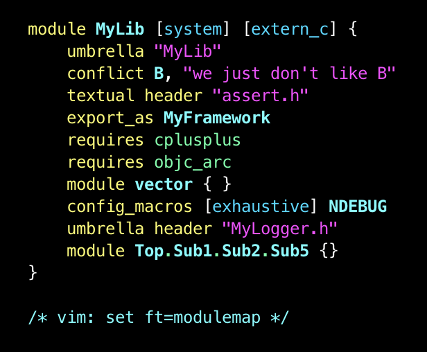

# Vim `module.modulemap` Syntax Highlighting

Using the following modulemap file:

```modulemap
module MyLib [system] [extern_c] {
    umbrella "MyLib"
    conflict B, "we just don't like B"
    textual header "assert.h"
    export_as MyFramework
    requires cplusplus
    requires objc_arc
    module vector { }
    config_macros [exhaustive] NDEBUG
    umbrella header "MyLogger.h"
    module Top.Sub1.Sub2.Sub5 {}
}

/* vim: set ft=modulemap */
```

`vim` 9.0.2100 (Homebrew-installed version) produces this result:


